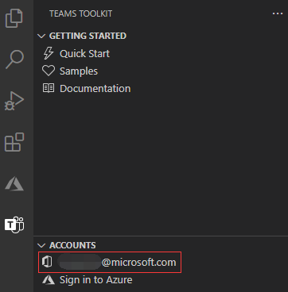
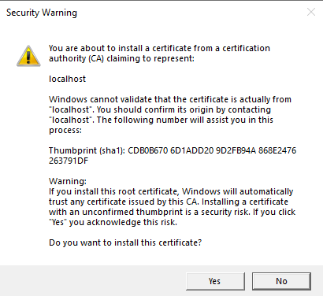
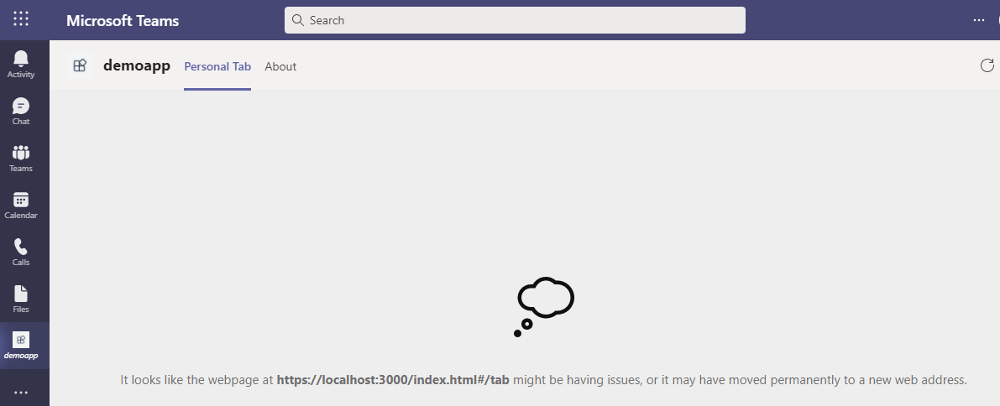
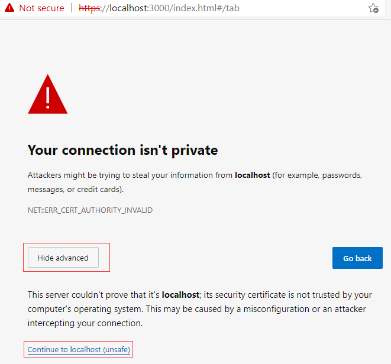

# Local Debug FAQ

## Overall
Teams Toolkit allows you to debug your Teams app locally by leveraging Visual Studio Code debugging features. After pressing F5, several components of the app will be automatically started. The Teams web client will then be launched in your browser. Specifically, the following components may be started according to your app capacities:
- Tab: a react app required by Teams Tab capacity
- Auth: an authentication service acting as a proxy between the app and Azure Active Directory
- Function: a Azure Functions app that may be needed by Tab
- Bot: a bot server required by Teams Bot capacity
- Ngrok: a tunneling service required by Teams Bot that forwards local address to public address

During debugging, a localhost development certificate will also be automatically generated and installed to your system after your confirmation.

Some frequently asked questions are listed bellow.

## Which ports will be used?
| Port | Component |
| --- | --- |
| 3000 | Tab |
| 5000 | Auth |
| 7071 | Function |
| 9229 | Node inspector for Function |
| 3978 | Bot / Messaging Extension |
| 9239 | Node inspector for Bot / Messaging Extension |

## What to do if some port is already in use?

### Error


### Reason
This is mainly because this port was not successfully closed after last local debug.

### Mitigation
You can follow the scripts below to find the process that occupies this port, and to kill that process. After the process is killed, start debugging again.

For Windows, in cmd or powershell:
```cmd
> netstat -ano | findstr <port>
> tskill <process id>
```

For Linux or OSX, in shell:
```shell
$ lsof -i:<port>
$ kill <process id>
```

## What to do if Teams shows "App not found" when the Teams web client is opened?
### Error


### Reason

This is mainly because the Teams account you logged in when the Teams web client is opened is different from the M365 account you logged in when developing the Teams app.

### Mitigation
Please make sure you use the same M365 account. After logging in the correct account, start debugging again. You can see which M365 account you logged in via Teams Toolkit, like:



## What to do if Teams shows "Permission needed" when the Teams web client is opened?
### Error


### Reason

This is mainly because the custom app uploading is not turned on for your Teams tenant.

### Mitigation
You can follow [this document](https://docs.microsoft.com/en-us/microsoftteams/platform/concepts/build-and-test/prepare-your-o365-tenant#enable-custom-teams-apps-and-turn-on-custom-app-uploading) to turn it on.

## What to do if I want to use my own tunneling service instead of the built-in one for Bot or Messaging Extension?
### Reason
Since Bot and Messaging Extension requires a public address as the messaging endpoint, ngrok will be used by default to automatically create a tunnel connection forwarding localhost address to public address.

### Mitigation
To use your own tunneling service, set the following configurations in *.fx/default.userdata* under the project root, then start debugging, like:
```
fx-resource-local-debug.skipNgrok=true
fx-resource-local-debug.localBotEndpoint=https://767787237c6b.ngrok.io
```
Please note that the `localBotEndpoint` should use https protocol.

## What to do if I do not want to install the development certificate?
### Reason
Since Teams requires https Tab hosting endpoint, a localhost development certificate will be automatically generated and installed to your system after your confirmation. The confirmation window will be popped up during debugging, like:



### Mitigation
We recommend you to install the development certificate. However, if you do not want to install the development certificate and do not want the confirmation window to pop up every time during debugging, you can follow the script bellow to disable the development certificate.

Set the following configuration in *.fx/default.userdata* under the project root, then start debugging, like:
```
fx-resource-local-debug.trustDevCert=false
```
If so, an error will show in the Tab page of your app, look like:



To resolve this issue, open a new tab in the same browser, go to https://localhost:3000/index.html#/tab, click the "Advanced" button and then select "Proceed to localhost (unsafe)". After doing this, refresh the Teams web client.

